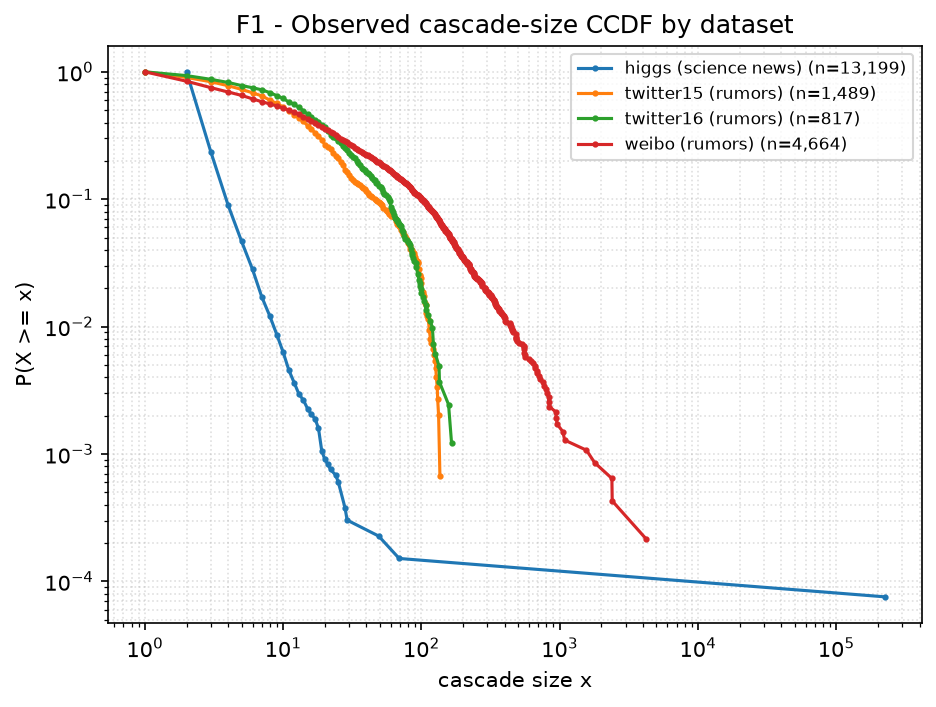
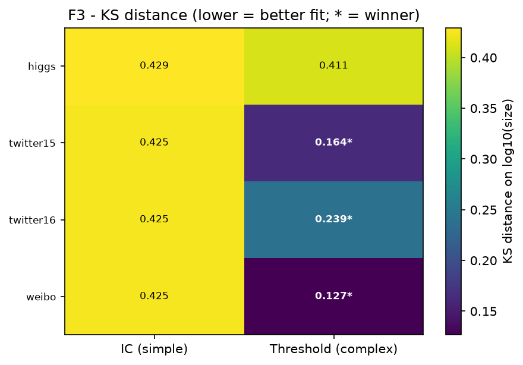
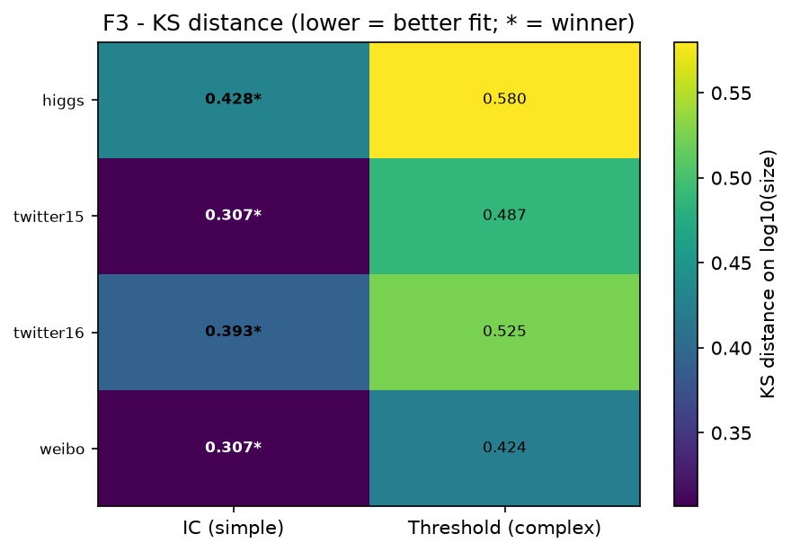
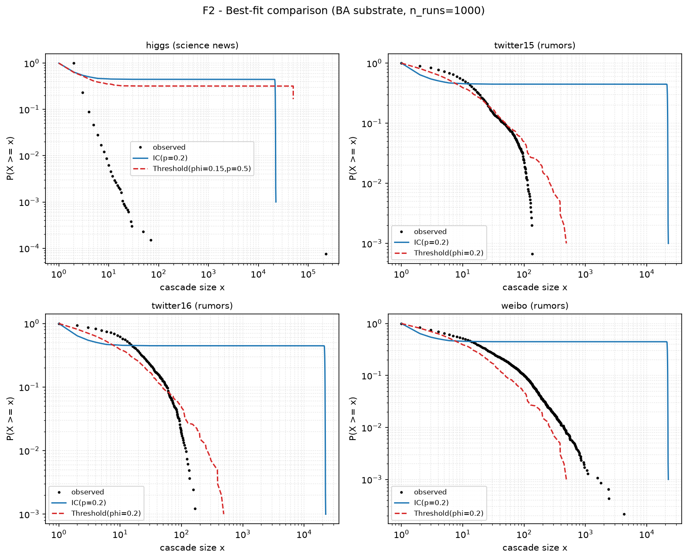
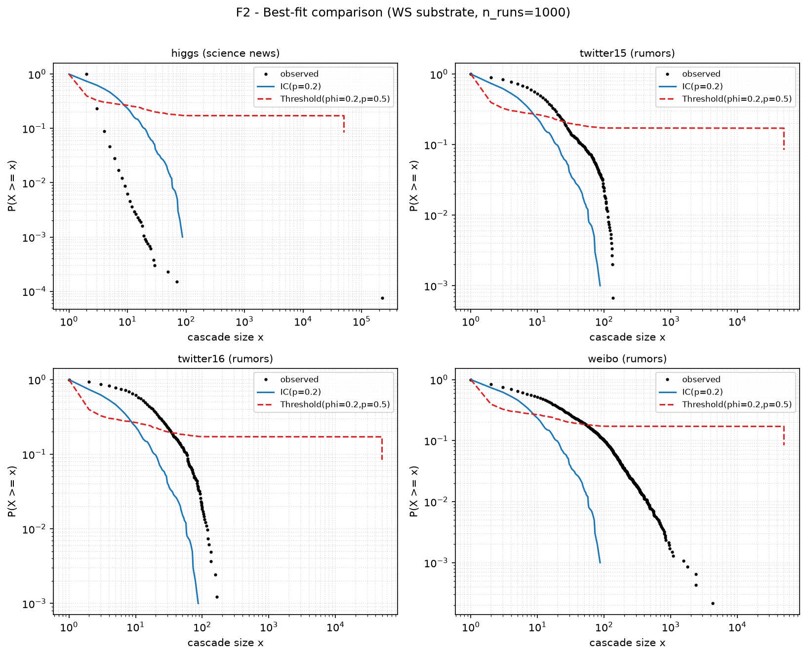
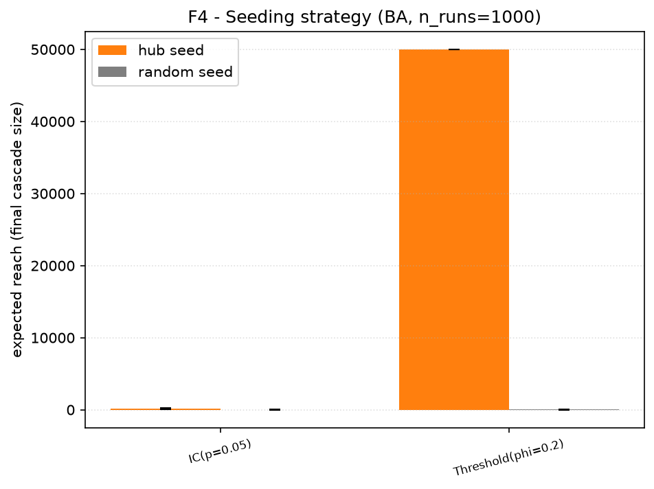
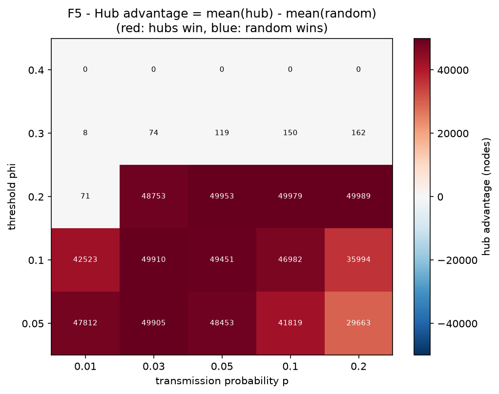
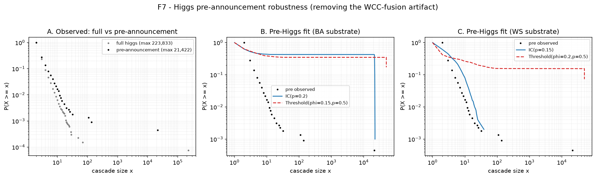
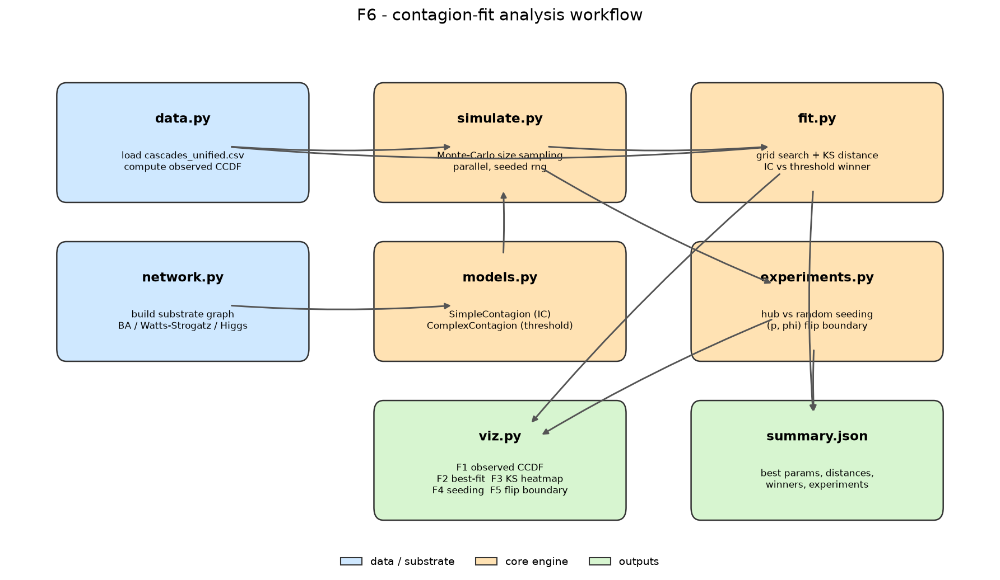

# やさしい解説 — このプロジェクトで結局なにをしたの？

> [FINDINGS_ja.md](FINDINGS_ja.md) の内容を、たとえ話と図でうんと簡単にした version です。
> 図は **Mermaid**（自動レイアウトなので枠ズレなし）と、ズレないよう半角だけにした図を使っています。

---

## 🎯 一言でいうと

> **「ネットの“バズり方”には2タイプある。実際のバズりデータを見て、どっちのタイプか当てにいった」**

そして分かったのは —— **「答えは“人のつながり方”次第でひっくり返る」** ということ。

---

## 1. そもそも何を知りたかった？ — “うわさ”は2タイプある

情報が広がる仕組みには、大きく2タイプあります。

### タイプA：単純伝播（カンタンに燃え移る）🔥

**1人**から聞いただけで、自分も広める。ニュース・うわさ・ウイルスがこのタイプ。

```
  一人から聞いたら、自分もシェア。どんどん横へ伝わる。

  [A] --share--> [B] --share--> [C] --share--> [D] --share--> [E]
```

### タイプB：複雑伝播（みんながやってないと動かない）🧱

**複数の友達**がやってるのを見て、はじめて自分も参加。新しい流行・デモ参加がこのタイプ。

```
  複数の友達がやってるのを見て、はじめて自分も動く。

  [friend A] --\
  [friend B] ---->  (YOU)  --"3人も見たので参加"-->  [join]
  [friend C] --/
```

> **問い**：実際のSNSのバズりは、タイプA（単純）とタイプB（複雑）、どっちで説明できる？
> しかもそれは、科学ニュースとうわさで違う？ TwitterとWeiboで違う？

---

## 2. なにを材料にした？ — 本物のバズり 2万件

過去に実際に起きた拡散データ **20,169件** を使いました。

| データ | 中身 | 件数 |
|---|---|---|
| 🔬 Higgs | 「ヒッグス粒子発見！」科学ニュースの拡散 | 13,199 |
| 🐦 Twitter15/16 | うわさ（本当/ウソ/未確認/非うわさ） | 2,306 |
| 💬 Weibo | 中国SNSのうわさ/非うわさ | 4,664 |

各データは「**1回のバズり = 何人が拡散に参加したか**（カスケードサイズ）」という形です。

---

## 3. どうやって調べた？ — “料理を当てる”ゲーム

「本物のバズり」と「自分で作ったシミュレーション」を見くらべて、似てる方のタイプを答えにします。

```
  本物のバズり(正解)  <----- どれだけ似てる? (KS距離) ----->  シミュレーション(A or B)
```

手順はこれだけ：

```
  1. にせバズりを作る (タイプA と タイプB の両方で)
          |
  2. 本物とどれだけ似てるか採点 (= KS距離)
          |
  3. 似てる方のタイプが勝ち
          |
  4. 4データセットで繰り返して判定表を作る
```

---

## 4. 「似てる度」をどう測る？ — KS距離

バズりは「**ほとんど小さく、たまに超巨大**」という形。本物とシミュレーションを同じグラフに描いて、**縦方向のズレが一番大きいところ**を測ります。それが **KS距離**。

```
  ratio
  1.0 |***
      |   ***            *** = real (本物)
      |  o   **          ooo = simulation (にせ)
      |   o    **
      |    oo    **   <=== biggest gap = KS distance
      |     ooo    ***
  0.0 +--------------------> cascade size (log)
```

- **KS距離が小さい（0に近い）= そっくり = 良いモデル** ✅
- **KS距離が大きい（1に近い）= 全然ちがう = ダメなモデル** ❌

> 例：「タイプA = 0.42」「タイプB = 0.13」なら、**小さいタイプBの勝ち**。

### まず本物のデータの形（図F1）

4つのデータの分布を重ねたもの。右肩下がりで「小さいバズりばかり、巨大はごくわずか」という共通の形が見えます。



---

## 5. ここが肝心 — “土台”を2種類ためした

シミュレーションには「**誰と誰がつながっているか**」という土台が必要です。
つながり方を2タイプ用意しました。これが結論を左右します。

### 土台BA：スター社会 🌟（人気者がいる）

現実の「フォロワー網」っぽい。**人気者(ハブ)が少数、普通の人が大多数**。

```
        [o]   [o]
          \   /
   [o]---[ HUB ]---[o]      HUB = 人気者(少数)
          /   \             o   = 普通の人(多数)
        [o]   [o]
```

### 土台WS：ご近所社会 🏘️（みんな平等）

現実の「地縁・職場グループ」っぽい。**人気者はいない。近所で固まっている**（友達の友達も友達）。

```
   [o]-[o]-[o]-[o]
    | X | X | X |        みんな同じくらいの友達数
   [o]-[o]-[o]-[o]        近所で密(三角形が多い)
```

| | BA：スター社会 | WS：ご近所社会 |
|---|---|---|
| 人気者(ハブ) | **いる**（一極集中） | いない（みんな平等） |
| つながりの密度 | バラバラ | **ご近所で密** |
| 例 | SNSのフォロワー | 友達・職場グループ |

---

## 6. 結果 — 土台でひっくり返った！

### 判定表（図F3）— 土台ごとに1枚ずつ、計2枚

色が**濃い（紫）ほど数字が小さい＝そっくり＝良いモデル**。★がその行の勝者です。
**同じ勝負を土台を変えて2回**やったので、図も2枚あります。

**① スター社会（BA）での判定** — うわさ3つは右列（複雑）に★：



**② ご近所社会（WS）での判定** — 全部が左列（単純）に★：



> 👀 2枚を見くらべると、**★が左列（単純）と右列（複雑）でゴッソリ入れ替わっている**のが分かります。
> これが「土台で勝者が反転する」の正体です。

2枚をまとめて言葉にすると 👇

| データ | 🌟BA社会での勝者 | 🏘️WS社会での勝者 |
|---|---|---|
| 🔬 科学ニュース | 引き分け（→ 後述で複雑に決着）| **タイプA（単純）** |
| 🐦 うわさ Twitter15 | **タイプB（複雑）** | **タイプA（単純）** |
| 🐦 うわさ Twitter16 | **タイプB（複雑）** | **タイプA（単純）** |
| 💬 うわさ Weibo | **タイプB（複雑）** | **タイプA（単純）** |

> **同じデータなのに、土台を変えると勝者が逆になった！** 😲
> （科学ニュースのBAだけ「引き分け」ですが、これは後述§9のHiggsの"おばけデータ1個"が原因。それを直すと複雑寄りに決着し、うわさと同じパターンになります）

### なぜ逆になる？ — “暴走するのはどっちか”が入れ替わる（図F2）

下の図で、**黒い点が本物**、青線=タイプA（単純）、赤線=タイプB（複雑）。線が黒点に沿ってるほど良いフィットです。これも土台ごとに1枚ずつあります。

**① スター社会（BA）**：青線（タイプA）が右上で真横にベターっと伸びて本物から外れている＝タイプAがダメ：



**② ご近所社会（WS）**：今度は赤線（タイプB）が外れ、青線（タイプA）が本物に沿う＝立場が逆転：



ポイントは、**「真横にベターっと伸びる＝極端な2択になって本物を再現できない」線が、土台しだいで青(BA)↔赤(WS)で入れ替わる**こと。これが勝敗反転の正体です。

```
  [1人の種] --+--> 消える               (約57%)
              |
              +--> 全員に大炎上 5万人    (約43%)
```

スター社会では、人気者に火がつくと一気に全員へ。だから**タイプAは極端**になり、本物の「ほどほど」を再現できません。タイプBはブレーキが効くのでほどよくフィット → **うわさはタイプBの勝ち**。

**ご近所社会（WS）では、これが逆**。今度はタイプBが極端になり、タイプAがほどよくフィット → **タイプAの勝ち**。

---

## 7. 一番大事な結論 🏆

> ## 「どっちのタイプか」の答えは、**人のつながり方しだいでひっくり返る**

- スター社会（フォロワー網）で考えると → **うわさは複雑伝播**っぽい
- ご近所社会で考えると → **ぜんぶ単純伝播**っぽい

だから「**情報はぜったい単純伝播だ**」のような**1つの断言はできない**。
むしろ **「土台の仮定しだいで答えが変わる」こと自体が発見**でした。

> 🤔 **最初の予想は外れました**。「科学ニュース（情報）は単純、うわさ（社会的な行動寄り）は複雑、と中身で分かれるのでは？」と思っていましたが、
> 実際には **中身の種類より"土台"のほうが結果を強く支配**しました。「科学ニュース=単純／うわさ=複雑」というキレイな色分けにはならなかった——これも正直な発見です。
> （そもそも今回のデータは全部「リツイート/シェア」で、純粋な"行動"のデータは無いので、情報 vs 行動の比較は近似的、という限界もあります）

これは有名な理論（Centola & Macy）の予測どおりの向きに出ています。

```
  スター社会 (遠くへの橋が多い)  --> 単純伝播が暴走して観測に合わない --> 複雑伝播の勝ち
  ご近所社会 (ご近所で密)        --> 複雑伝播が暴走して観測に合わない --> 単純伝播の勝ち
```

> ちょっと不思議な対応関係に注意：**「その街で勢いづくタイプほど、極端になりすぎて本物の"ほどほど"を再現できず、負ける」**。理論の「広がりやすさ」と、フィットの「本物との近さ」は別物です。

---

## 8. おまけの実験：誰から広める？（図F4・F5）

「最初の1人（種）を**人気者**に置くか、**ランダムな人**に置くか」で結果が変わるか実験。



```
  人気者から種まき   --> 大炎上 約5万人
  ランダムに種まき   --> ほぼ消滅 数人
```

→ スター社会では、**人気者から広めるのが圧倒的に有利**でした。

下は (伝わりやすさ × 慎重さ) のあらゆる組み合わせで、人気者起点がどれだけ有利かを示した地図（赤＝人気者が有利）。



---

## 9. 念のための確認 — ズルや偶然じゃない？ 🔍

結論（土台で反転）が「たまたま」や「不公平な比較」じゃないか、2つの裏取りをしました。

### 確認①：各タイプに"一番いいパラメータ"を全部試した（不公平じゃない）

「タイプAが負けたのは、ちょうど悪い設定を選んだだけでは？」を防ぐため、各タイプの設定（伝わりやすさ p、慎重さ φ）を**幅広く総当たりして、一番本物に似る設定どうしで勝負**させています。最初グリッドが狭くてタイプAが端で頭打ちになっていたので、**範囲を広げて再確認** → それでも**勝敗は変わりませんでした**（8ケース中7ケースで同じ、残り1つも僅差）。

### 確認②：Higgsの"おばけデータ1個"を取り除いて再確認（図F7）

Higgsには **22万人の超巨大カスケードが1個だけ**あり、これは「発表直後にたくさんの拡散が1つにくっついて見える」**測定の歪み**でした（本物の1個の拡散ではない）。

そこで「外れ値として消す」のではなく、**歪みの原因を断つ**ために、**発表より前（7/1〜7/3）のデータだけ**でHiggsをつくりなおしてKS距離を測り直しました:



- おばけ（22万）→ 2万に縮小し、土台にちゃんと載るサイズに。
- すると科学ニュースのBASの「引き分け」が**複雑寄りに決着**し、**うわさと同じ「土台で反転」パターン**に。
- → 結論は**覆らず、むしろ補強**されました。（※ただし2万のかたまりは発表前でも残っており、歪みは完全には消えない、というのも正直に記録）

---

## 10. ぜんぶ一枚で（ワークフロー図 F6）

このプロジェクトの処理の流れです。



---

## 🍱 究極のまとめ（たとえ話）

> **同じ「火の点きやすさ」でも、置く場所が「花火大会の会場」か「住宅街」かで燃え広がり方は全然ちがう。**
>
> このプロジェクトは「ネットのバズりという火を、2種類の街（スター社会／ご近所社会）に置いてみたら、
> 『どんな火だったか』の結論が街しだいでひっくり返った」という話。
>
> **だから “バズらせ方” を決めるには、まず自分の商材が「どんな街（つながり）」で広がるのかを見極めることが先**。
> これがビジネスへの示唆です。

---

### もっと詳しく知りたい人へ
- 数値や方法の正確な記述 → [FINDINGS_ja.md](FINDINGS_ja.md)
- 設計思想 → [DESIGN.md](DESIGN.md)
- 動かし方・コード → [README.md](README.md)
