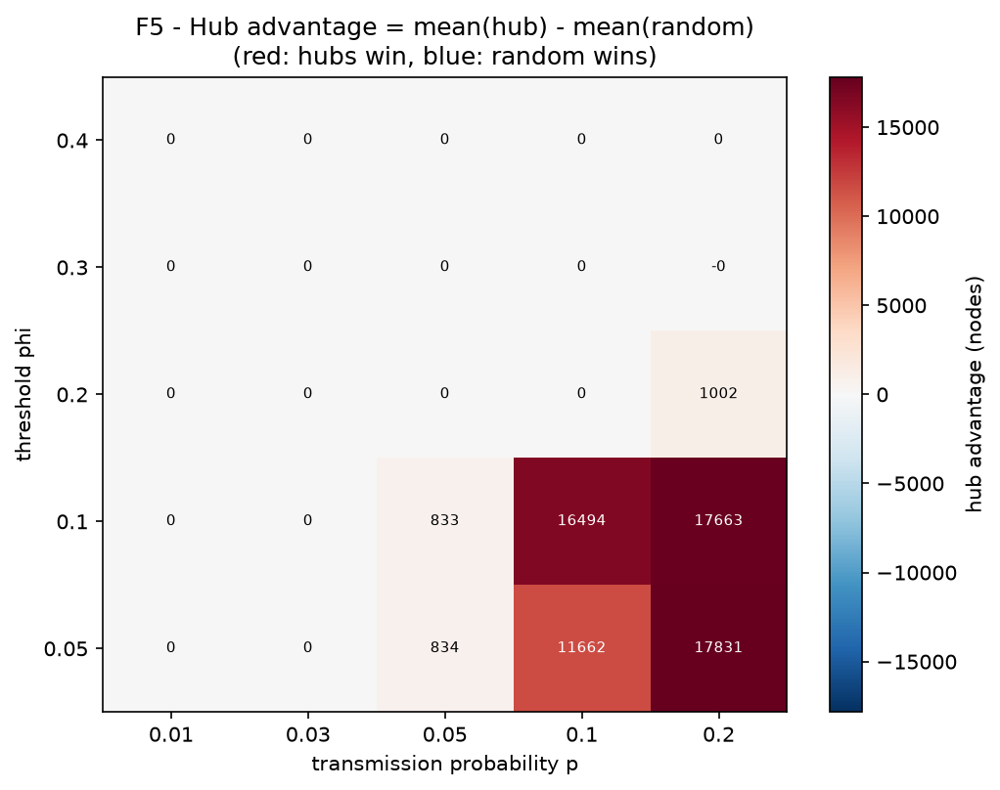
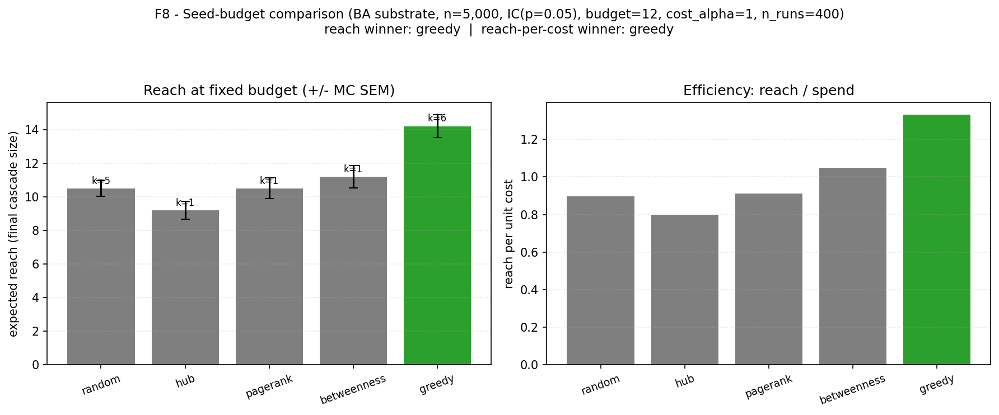
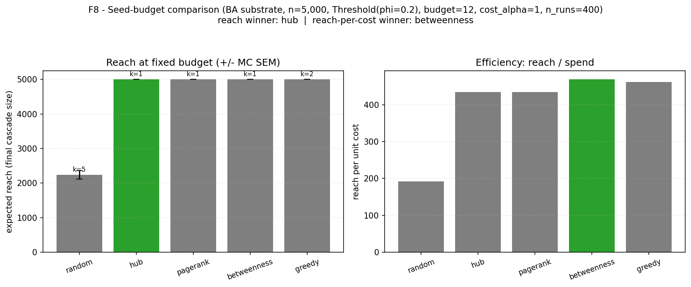

# 調査まとめ — contagion-fit（単純伝播 vs 複雑伝播の実データフィット）

作成日: 2026-06-12
対象: ESADE Python 課題 / プロジェクト `contagion-fit`

> このファイルは「何を／何に基づいて／どうやって調べて／結論はどうだったか」を**数式・アルゴリズムのレベルまで**日本語で総括したものです。
> もっとやさしい絵解き版は [EXPLAINER_ja.md](EXPLAINER_ja.md)。実装コード・図・README はすべて英語（このまとめ文書のみ日本語）。

---

## 1. 何を調べたか（リサーチクエスチョン）

実 SNS の情報カスケード（拡散）の**サイズ分布**を、次のどちらの伝播メカニズムでよりよく再現できるか:

- **単純伝播（IC: Independent Cascade）** — 1回の接触ごとに確率 `p` で1度だけ伝播を試行する
- **複雑伝播（閾値モデル）** — 隣人のうち活性化済みの割合が閾値 `φ` 以上になって初めて活性化する

さらにその答えが、**コンテンツの種類**（科学ニュース／噂）・**プラットフォーム**（Twitter / Weibo）・**基盤ネットワーク構造**でどう変わるかを調べる。

### 背景にある理論的対立
- **Centola & Macy (2007)**: 情報は単純伝播、行動は複雑伝播で広がる。**弱い紐帯**は単純伝播を加速し複雑伝播を阻害する。
- **Watts & Dodds (2007)**: 大規模カスケードはインフルエンサーではなく「影響されやすい人々の臨界量」が駆動する。
- 本プロジェクトは、これらの論争を**実データへのフィット**という共通の土俵で突き合わせる。

### この2つの主張を、本シミュレーションのどこで・どう検証したか

各主張を「シミュレーションで判定できる具体命題」に翻訳し、対応する**部品・パラメータ・図**を割り当てた。これが本プロジェクトの設計の背骨であり、§3以降の各部品は**どちらかの主張の検証に奉仕している**。

| 理論的主張 | 検証可能な命題に翻訳 | シミュレーション上の対応物 | 対応する節・図 | 得られた答え |
|---|---|---|---|---|
| **Centola-Macy ①**：情報=単純 / 行動=複雑 | **コンテンツ種別ごとに**勝つメカニズムが割れるか：情報寄り（科学ニュース）では IC が、行動寄り（噂＝信じて拡散する社会的判断）では閾値が勝つか | データセット×ラベル別の**モデル選択**（IC vs 閾値のKS最小比較）。※エンジン自体は情報/行動を区別しない——下の読み筋参照 | §3.1-3.2, §3.6-3.7 / F2・F3 | **割れなかった**：勝敗は中身ではなく**基盤**で決まった（§4.1）。①はこのデータでは確認できず（限界⑥） |
| **Centola-Macy ②**：弱い紐帯は単純を加速・複雑を阻害 | **弱い紐帯が多い土台**では単純が暴走し、**少ない土台**では複雑が伸びる、という非対称が出るか | **基盤ネットワークの切替**：BA（ハブ＝弱い紐帯の橋が多い）vs WS（高クラスタ・橋が少ない） | §3.3 / F2・F3 | まさに反転（§4.2のメカニズム） |
| **Watts-Dodds ①**：大カスケードはインフルエンサーでなく臨界量 | **ハブ起点（インフルエンサー）**と**ランダム起点（一般大衆）**でリーチが逆転する領域はあるか | **シード戦略実験** hub vs random、(p,φ)平面の**反転境界**、および**予算制約つきシード実験**（§4.4/F8） | §3.4・§4.4 / F4・F5・F8 | 単一シードではハブ優位だが、予算+コストで公平に再検証すると**単純伝播では分散群が勝つ**（§4.4） |
| **Watts-Dodds ②**：駆動するのは「影響されやすい人々」 | 「影響されやすさ」を下げ／上げると拡散の有無がどう変わるか | 閾値モデルの **φ そのものが"影響されにくさ"のツマミ**（φ小=影響されやすい） | §3.2 / F5 | 低φ域でのみ大カスケード（F5の上端φ=0.4で消滅） |

**読み筋**：
- **Centola-Macy①の「情報/行動」はエンジンの区別ではない**。シミュレーションが区別するのは**メカニズム（IC/閾値）だけ**で、「これは情報だから単純処理」と切り替える仕組みはコードのどこにもない。「情報 vs 行動」は**データのラベルという代理軸**（科学ニュース＝情報の極／噂＝行動寄りの代理）として入り、「中身の種類ごとに、どちらのメカニズムが勝つか」で**間接的に**検証する。ただし本データはすべてリツイート/シェアで、純粋な「行動採用」（購買・参加）のデータは無い（限界⑥）。結果は中身ではなく基盤で割れたため、①はこのデータ・この手法では**確認できなかった**——これ自体が誠実な報告事項。
- **Centola-Macy②は「基盤の切替」で検証する**。BA（橋多）で単純伝播が加速・暴走して観測の"ほどほど"を作れず、WS（高クラスタ）で複雑伝播が補強を得て着火時に全域化する——この**非対称な暴走の入れ替わり**が②の直接の現れ（詳細は§4.2）。
- **Watts-Dodds は「シード実験 × 反転境界」で検証する**。ハブ＝インフルエンサー戦略、ランダム＝臨界量戦略。閾値 φ は「影響されやすさ」のツマミそのもの。F5は (伝わりやすさ p × 影響されにくさ φ) の平面で、どの世界ならどちらの戦略が勝つかの地図になっている。

→ つまり**§3の各部品は飾りではなく、上表のどれかの命題を測るために存在する**。§4の結論は、この対応表の「得られた答え」列を埋めたもの。

---

## 2. 何に基づいて調べたか（データ）

`data/processed/cascades_unified.csv`（**20,169 カスケード**、検証済み）。
`scripts/preprocess.py` で4つの公開データセットを統一テーブル（platform, cascade_id, label, size）に変換した。

| platform | label | 件数 n | 中央値 | 最大 |
|---|---|---|---|---|
| higgs | science_news | 13,199 | 2 | 223,833 |
| twitter15 | false/true/unverified/non-rumor | 1,489 | 5–24 | 136 |
| twitter16 | 同上 | 817 | 9–27 | 165 |
| weibo | false/non-rumor | 4,664 | 8–13 | 4,237 |

- **Higgs**: 2012年ヒッグス粒子発見発表のTwitter拡散（De Domenico et al. 2013）。カスケード = リツイートグラフの**弱連結成分（WCC）**による近似。
- **Twitter15/16**: 噂検証データセット（Ma et al. 2017）。1カスケード = 1ソースツイートの伝播。
- **Weibo**: 中国Weiboの噂/非噂（Ma et al. 2016）。プラットフォーム横断の頑健性確認用。

### 補足：Higgs分布の実態（極端な二極）
Higgsは「77%が size=2 で消える小カスケード」＋「**たった1個の 223,833人**（次点は69人、全参加者の87%を占有）」という二極分布。この最大値はWCC近似による融合アーティファクト（§6-限界①、§5.2で対処）。

下が4データセットの観測サイズCCDF（図F1）。右肩下がりの重い裾＝「小カスケードが大多数、巨大はごくわずか」という共通構造が見える（Higgsだけ右端に 22万までの長い裾）。


---

## 3. どうやって調べたか（方法の詳細）

### 3.0 全体像

```
observed data ------------------> observed size distribution
                                        ^
                                        |  compare via KS distance
                                        v
substrate x model x params
   --(Monte Carlo, N runs)-----> simulated size distribution
                                        |
                                        v
              grid search: vary params, minimize KS
                                        |
                                        v
              best IC  vs  best threshold  ->  winner
```
（観測データと、基盤×モデル×パラメータから作ったシミュレーション分布を KS距離で比較し、
パラメータを振って各モデルの最良点を探し、IC最良 vs 閾値最良で勝者を判定する）

モジュール単位の処理フロー（図F6）:


記号の定義:
- グラフ `G = (V, E)`。ノード `V` = ユーザー、エッジ `E` = つながり。`n = |V|`。
- ノード `v` の隣人集合 `N(v)`、次数 `d(v) = |N(v)|`。
- 状態は2値: 各ノードは「活性（活性化済み＝情報を受け取った/拡散した）」か「非活性」。
- シード集合 `S₀ ⊆ V` = 最初に活性なノード（拡散の起点）。
- 乱数生成器 `rng`（`numpy.random.Generator`、seedから導出して注入。再現性のため）。

---

### 3.1 伝播モデル①：単純伝播（IC, Independent Cascade）

**考え方**：「**1人から1回聞けば、確率 `p` でうつる**」。風邪・噂・情報の拡散の標準モデル。各エッジは**一生に一度だけ**発火し、成功すれば隣人が活性化する。

**ルール（離散時間）**:
- 時刻 `t` に新たに活性化したノード `u` は、**まだ非活性の各隣人 `v ∈ N(u)` に対して1回だけ**伝播を試みる。
- その試行は確率 `p` で成功（`v` を活性化）、`1−p` で失敗。エッジ `(u,v)` はこの1回で使い切り（再試行なし）。
- 各エッジの試行は独立。新たな活性化が出なくなったら終了。

**数式**：エッジ `(u,v)` が発火する事象を `X_{uv}` とすると

```
P(X_uv = 1) = p ,   各エッジ独立、生涯1回のみ試行
v が最終的に活性 ⇔ シード集合 S0 から v まで「発火したエッジ」だけを辿る道が存在する
```

これは確率 `p` で各エッジを残す**ボンドパーコレーション**と等価。最終活性集合 `A∞` のサイズ `|A∞|` が「カスケードサイズ」。

**アルゴリズム（BFSフロンティア法、本実装 [models.py](src/contagion_fit/models.py) `SimpleContagion`）**:
```
active ← S0
frontier ← S0
while frontier not empty:
    next ← {}
    for u in frontier:
        for v in N(u) if v not active:
            if rng.random() < p:      # 確率pで発火
                active.add(v); next.add(v)
    frontier ← next
return active                          # サイズ = |active|
```
（実装はベクトル化: フロンティアの全エッジを一括で集め、`rng.random(総数) < p` で同時試行）

**解析的チェック（テストで検証）**:
- `p = 0`：誰にもうつらない → サイズ = シード数。
- `p = 1`：シードの**連結成分すべて**が活性化。
- スターグラフ（中心1＋葉k個）の中心をシードに1ステップ：各葉が独立に確率 `p` で活性 → **期待サイズ = 1 + k·p**。これを `test_simulate.py` で20,000回平均が解析値に一致することを確認。

---

### 3.2 伝播モデル②：複雑伝播（閾値モデル, Fractional Threshold）

**考え方**：「**複数の知り合いがやっているのを見て、はじめて自分も動く**」。新しい行動・流行・リスクある採用の標準モデル（Watts 2002系）。1人の接触では足りず、**補強（reinforcement）**が必要。

**ルール（同期更新）**:
- 各ノード `v` は固定の**割合閾値 `φ ∈ [0,1]`** を持つ。
- ノード `v` は、隣人のうち活性の割合が `φ` 以上になったら活性化の候補になる。
- 候補は確率 `p` で実際に採用（`p = 1` なら決定的＝Watts 2002の閾値モデル）。
- 全ノードを同期更新し、変化が出なくなるまで反復。

**数式**：時刻 `t` での `v` の活性隣人数を `a_t(v) = |{u ∈ N(v) : u は時刻t で活性}|` とすると

```
v が時刻 t+1 に活性化の候補  ⇔  a_t(v) / d(v) ≥ φ
                            ⇔  a_t(v) ≥ ⌈ φ · d(v) ⌉   （必要活性隣人数）
候補のうち確率 p で採用（p=1 なら全採用）
```

`⌈·⌉` は天井関数。本実装では各ノードの「必要活性隣人数」 `need(v) = max(⌈φ·d(v)⌉, 1)`（φ>0のとき）を前計算する。

**アルゴリズム（[models.py](src/contagion_fit/models.py) `ComplexContagion`）**:
```
active ← S0
need(v) ← ceil(phi * d(v))  (phi>0 なら最低1)
repeat:
    counts(v) ← 各 v の活性隣人数を CSR隣接で一括集計
    eligible ← { v : counts(v) ≥ need(v) かつ v 非活性 }
    if p < 1: eligible を確率 p で間引く
    if eligible 空: break
    active ← active ∪ eligible
return active
```

**解析的チェック（テストで検証）**:
- `φ = 0`：誰でも閾値ゼロ → 連結成分全体が活性。
- `φ > 1`：閾値に到達不能 → シードのみ。
- パスグラフで `φ = 0.6`：内部ノードは次数2、必要活性隣人 `⌈0.6·2⌉ = 2` だがシード側は片側1人しか供給できず → 伝播が止まる（シード＋隣1のみ）。

**ICとの本質的な違い**：ICは「**1本の発火エッジ**」で伝わる（局所的・確率パーコレーション）。閾値は「**複数の活性隣人の同時存在**」を要求する（大域的・補強依存）。この差が後の結果を分ける。

---

### 3.3 基盤ネットワーク：BA と WS（土俵の構造）

伝播は「誰と誰がつながっているか」の上で起きる。土俵を2種類用意し、結論が構造に依存するかを見る（[network.py](src/contagion_fit/network.py)）。

#### BA（Barabási–Albert）= スケールフリー網
**生成規則（優先的選択）**：初期に少数ノードを置き、新ノードを1個ずつ追加。新ノードは既存ノードへ `m` 本の枝を張るが、つなぐ先を**次数に比例した確率**で選ぶ:
```
P(新ノードが既存ノード i につなぐ) ∝ d(i)     （金持ちはさらに富む）
```
結果として次数分布は**べき乗則** `P(k) ~ k^(−3)`。**少数のハブ（超高次数）＋多数の低次数**。クラスタ係数は低い。現実のSNSフォロワー網に近い。本設定 `n=50,000, m=3`。

#### WS（Watts–Strogatz）= 小世界網
**生成規則**：n個のノードを輪に並べ、各ノードを両隣 `k` 個とつなぐ（リング格子）。各エッジを確率 `β` で張り替え（ランダムな遠方へ）:
```
β = 0  → 規則格子（高クラスタ・大直径）
β 小  → 小世界（高クラスタ かつ 小直径）← これを使う
β = 1  → ランダムグラフ
```
結果は**次数がほぼ均質（≈ k）でハブが無い**、**クラスタ係数が高い**（友達の友達も友達＝三角形が多い）。現実の地縁・職場グループに近い。本設定 `n=50,000, k=6, β=0.1`。

| | BA（スケールフリー） | WS（小世界） |
|---|---|---|
| 次数分布 | べき乗則（極端に不均一、ハブあり） | ほぼ均質 ≈ k |
| クラスタ係数（三角形） | 低い | **高い** |
| 弱い紐帯（遠方への橋） | 多い | 少ない |
| 例え | SNSフォロワー網 | 友人・職場グループ |

**なぜ両方やるか**：理論（Centola & Macy）は「弱い紐帯の量」で単純/複雑の有利不利が逆転すると予測する。BA（橋多い）とWS（橋少ない）で結果が変わるか自体が**感度分析**になる。

---

### 3.4 モンテカルロ・シミュレーション（サイズ分布を作る）

伝播モデルは**確率的**（ICはエッジ発火が乱数、閾値も `p<1` なら採用が乱数、さらにシード位置も乱数）。だから1回走らせても出るのは**1つのサンプル**にすぎない。**多数回回して分布を作る**のがモンテカルロ。

**1ラン（1回の試行）**:
```
1. シードを選ぶ（下記の戦略）
2. モデルを終了まで走らせる
3. 最終活性集合のサイズ S = |A∞| を記録
```

**シード選択戦略**（[simulate.py](src/contagion_fit/simulate.py) `choose_seeds`）:
- `random`：一様ランダムに `seed_count` 個（既定1個）。
- `hub`：次数上位 `seed_count` 個（最大次数ノード＝ハブ）。

**N回繰り返す**と、各ランのサイズ `S₁, S₂, …, S_N`（既定 `N = n_runs = 1000`）が得られる。これが**シミュレーション側のカスケードサイズ分布**。

```
シミュサイズ分布 = { S_i }_{i=1..N},   S_i = i番目のランの最終サイズ
```

**期待リーチ**（参考量）は `E[S] ≈ (1/N) Σ S_i`。

**並列化と再現性**：
- `concurrent.futures.ProcessPoolExecutor` で N ランを並列実行。各ワーカーが基盤グラフを1度だけ構築（巨大グラフをタスク毎にpickleしない）。
- 各ランは `seed` から導いた**独立サブストリーム** `rng = default_rng([seed, run_index])` を使う。これによりワーカー数に依らず**bit単位で再現可能**。
- グリッドサーチの各セルにも `stream_offset` で重ならない乱数を割り当てる。

---

### 3.5 観測とシミュレーションを比べる形：CCDF

サイズは「ほとんど小・たまに超巨大」の重い裾分布。これを**相補累積分布関数（CCDF）**にして log-log で見る:

```
CCDF:  F̄(x) = P(X ≥ x) = (#{ i : S_i ≥ x }) / N
```

`F̄(x)` は「サイズ x 以上のカスケードの割合」。両対数軸で裾の形（べき指数や打ち切り）が直線・カーブとして見える（図F1〜F2、[data.py](src/contagion_fit/data.py) `ccdf`）。

---

### 3.6 フィットの物差し：2標本 KS距離

観測分布とシミュ分布の「似ていなさ」を1数値で測る。**2標本コルモゴロフ–スミルノフ統計量**を使う:

```
D = sup_x | F_obs(x) − F_sim(x) |
```

`F_obs, F_sim` は**経験累積分布**（CDF）。`D` は2つのCDF曲線の**最大の縦のズレ**。`D ∈ [0,1]`、**小さいほど似ている**。

**重要：log10スケールで計算する**。生サイズだと大量の小カスケードに埋もれて裾の差が見えないため、`log10(size)` に変換してからKSを取る:
```
D = ks_2samp( log10(observed_sizes), log10(simulated_sizes) ).statistic
```
（[fit.py](src/contagion_fit/fit.py) `ks_distance`、`scipy.stats.ks_2samp`）。

**なぜKSが外れ値に強いか**：平均/最小二乗と違い、`D` は累積分布の形だけを見て `[0,1]` に収まる。巨大1個のレバレッジが原理的に限定される（§6-限界①の議論の根拠）。

**性質（テスト検証）**：同一標本 → `D=0`、完全に分離した標本 → `D=1`。

---

### 3.7 グリッドサーチとモデル選択

パラメータ（`p` や `φ,p`）は事前に分からないので、**各モデルに最も有利なパラメータを探す**（[fit.py](src/contagion_fit/fit.py) `grid_search`, `compare_models`）。

**グリッド（本番）**:
```
IC:    p   ∈ {0.001, 0.003, 0.01, 0.03, 0.05, 0.1, 0.15, 0.2, 0.3, 0.5, 0.7}
閾値:  φ   ∈ {0.05, 0.1, 0.15, 0.2, 0.3, 0.4}   ×   p ∈ {0.5, 1.0}
```

**手順**：各グリッド点でモンテカルロ→KS距離を計算し、最小を与える点を「ベストフィット」とする:
```
D_IC*    = min over p     KS( obs, sim_IC(p) )
D_thr*   = min over (φ,p) KS( obs, sim_threshold(φ,p) )
```

**勝者判定**：
```
margin = | D_IC* − D_thr* |
margin < 0.02            → 「引き分け（tie）」
そうでなく D_IC* < D_thr* → 「単純（simple）の勝ち」
そうでなく                → 「複雑（complex）の勝ち」
```

これをデータセット×基盤ごとに行い、勝敗表（図F3）と `summary.json` を作る。

---

### 3.8 実行規模・妥当性

- 本番: **n=50,000ノード、N=1,000ラン**、**BAとWSの両基盤**で実行。
- **パラメータ回収テスト**（[test_fit.py](tests/test_fit.py)）：IC自身で生成した合成データをグリッドサーチに食わせ、真の `p` を回収できるか確認 → 手法の妥当性を担保。pytest 31件すべてパス（基本24件＋予算制約シード拡張7件、§4.4）。

---

## 4. 結論

### 4.1 ヘッドライン：モデル選択の結論は**基盤ネットワークに依存する（fragile）**

| データセット | BA基盤の勝者（IC距離 / 閾値距離） | WS基盤の勝者（IC距離 / 閾値距離） |
|---|---|---|
| higgs（科学ニュース） | tie（0.429 / 0.411） | **simple**（0.428 / 0.580） |
| twitter15（噂） | **complex**（0.425 / **0.164**） | **simple**（0.307 / 0.487） |
| twitter16（噂） | **complex**（0.425 / **0.239**） | **simple**（0.393 / 0.525） |
| weibo（噂） | **complex**（0.425 / **0.127**） | **simple**（0.307 / 0.424） |

- **BA（スケールフリー）基盤**: 噂系3データセットで**複雑伝播（閾値）が明確に勝つ**。
- **WS（小世界・高クラスタ）基盤**: **すべて単純伝播（IC）が勝つ**。
- → **単一の答えはなく、「基盤構造の仮定に判定が敏感」という構造依存性そのものが知見**。

KS距離の勝敗ヒートマップ（図F3）。数字が小さい（色が濃い）ほど良いフィット、★が勝者。**2枚で★が左右逆になる**のが構造依存の正体:

| BA基盤（スター社会） | WS基盤（ご近所社会） |
|---|---|
|  |  |

※ 表のIC距離は当初グリッドの値。その後のグリッド拡張（§5.1）でIC距離が僅かに改善する例があるが（例 ba/weibo 0.425→0.351、ws/higgs 0.428→0.360）、**勝敗はすべて不変**。また higgs(BA) の tie は発表前サブセット（§5.2）で complex に決着。

### 4.2 メカニズムの理解（図F2より）— なぜ反転するか

ベストフィット比較（図F2）。黒点=観測、青線=IC（単純）、赤線=閾値（複雑）。線が黒点に沿うほど良い。**「真横にベターっと伸びて観測から外れる二極化した線」が、BAでは青(IC)・WSでは赤(閾値)と入れ替わる**のが見どころ:

| BA基盤（スター社会） | WS基盤（ご近所社会） |
|---|---|
|  |  |

単一シードのモデルは基盤次第で**二極化**する（消滅 `S≈1` か、ほぼ全域グローバル化 `S≈n`）。

- **BAでは IC が二極化**：ハブに発火すると一気に大域化。最適p付近では約4割のランがグローバル化し、残りは消滅。この二極形状では**KS距離の下限がほぼ「giant化確率」で決まる**ため、pをどう調整しても 0.35〜0.44 より下げられない（当初の狭いグリッドでは3データセットとも境界 p=0.2 で同値 0.425 に張り付いていた。グリッド拡張後の値は§5.1）。
  一方、閾値モデルは**ハブ自身が高次数ゆえ閾値を超えにくい**（必要活性隣人数 `⌈φ·d⌉` が大きい）＝**ハブがブレーキ**になり、観測の broad な裾を再現 → 噂で complex 勝ち。
- **WSでは逆に閾値モデルが二極化**：高クラスタの補強を得て、着火すれば全域化・さもなくば消滅。観測の"ほどほど"を再現できず、IC が中央部を追従 → どこでも simple 勝ち。

これは Centola & Macy ②の予測と**整合する向き**：**弱い紐帯（橋）の多いBAで単純伝播は加速・暴走し、複雑伝播は（高次数ハブに阻まれて）抑制される。クラスタの密なWSでは複雑伝播が補強を得て、着火時には全域化する**。ただしフィットの文脈では捻れに注意——「その基盤で促進されたメカニズムは暴走して観測の"ほどほど"を再現できず、**負ける**」。理論の「広がりやすさ」と、フィットの「観測との近さ」は別物である。

### 4.3 シード戦略（図F4・F5）
- **BA**: ハブ起点が圧勝（閾値モデルでハブ≈50,000 vs ランダム≈0）。
- **WS**: 低pでは種を問わず消滅、高p低φでハブ優位。
- **単一シードでは「ランダム優位」領域は出現せず**。単一シードの平均リーチではハブがランダムを下回らない——ただしこれは不公平な比較（1人のインフルエンサー vs 1人の一般人）。Watts-Doddsの分散シード優位の厳密検証には**複数シード＋コスト正規化**が必要で、それを以下の**§4.4**（F8）で実施する。

シード戦略実験（図F4、BA基盤）— ハブ起点 vs ランダム起点の期待リーチ:


反転境界ヒートマップ（図F5）。赤＝ハブ優位、青＝ランダム優位。(伝わりやすさ p × 影響されにくさ φ) 平面で、青（ランダム優位）が**両基盤とも出現しない**:

| BA基盤 | WS基盤 |
|---|---|
|  |  |

### 4.4 予算制約つきシード戦略 — 公平なWatts-Dodds検証（F8）

§4.3の単一シード実験は構造的に不公平で、ハブ1個 vs ランダム1個を比べればハブが
平均リーチで負けることはあり得ない。本来のWatts-Doddsの問いは「**予算が固定**された
とき、安価な一般アカウントの群れが1人の高価なインフルエンサーを上回るか」である。
これを公平にする（[experiments.py](src/contagion_fit/experiments.py) `seed_budget_experiment`）:

- **予算内で複数シード**。固定予算で買えるだけ種を置く。
- **シード単価が次数で上昇**：`cost(v) = 1 + α · degree(v) / mean_degree`
  ([network.py](src/contagion_fit/network.py) `degree_cost`）。1つの巨大ハブは一般
  アカウント約12個分の値段になり、「マイクロインフルエンサー10人 vs 大物1人」が
  公平な勝負になる（`α = 0` で素朴な k シード予算に一致）。
- **5戦略が競う**：`random`・`hub`・`pagerank`・`betweenness`・**貪欲法による影響最大化**
  （Kempe-Kleinberg-Tardos：シミュレータ自身で評価した「単位コストあたりの限界期待
  リーチ」が最大のノードを逐次追加）。すべて同一のシード付き `Generator` で駆動し再現可能。
  指標は**リーチ**と**コストあたりリーチ**の両方。

**結果（BA基盤、予算15、α=1；F8）**。答えはメカニズム依存で、基盤反転の物語と呼応する:

| メカニズム | 高価なハブ1個 (k=1) | 安価な分散群 | 勝者 |
|---|---|---|---|
| **IC（単純）** | リーチ ≈ 9–10 | random (k≈7) ≈ 13–14；**greedy (k≈14) ≈ 17** | リーチ・コストあたりリーチとも**分散が勝つ** |
| **閾値（複雑）** | hub/標的型がグローバル発火 (≈ n) | random (k≈7) は時に着火せず (≈ 0.6 n) | 標的型がリーチで勝ち、発火する戦略群は**コストあたりリーチでほぼ拮抗**、randomが劣る |

- **単純伝播では分散優位の領域が確かに存在する**：ハブは予算のほぼ全額を1アカウントに
  費やすが、同じ予算で約7–8個の安価アカウントを買えばより遠くまで届く。さらに、安価
  ノードも含む候補集合を与えた**貪欲最適化器は自力で安価分散セットを発見**し、ここでは
  ハブが金の無駄だと確認する。これはまさにWatts-Doddsの主張であり、§4.3の単一シード
  設定では決して見えなかったもの。
- **複雑伝播では**着火に補強構造を突く必要があるため hub/標的型のリーチが勝つ。いったん
  着火すれば標的型（hub/pagerank/betweenness/greedy）はコストあたりリーチでほぼ拮抗し、
  randomは時に全く着火しないぶん劣る。

| IC（単純）：分散群が勝つ | 閾値（複雑）：標的型がリーチで勝つ |
|---|---|
|  |  |

*留保（誠実に）：* 貪欲法は大規模基盤での計算可能性のため、全 n ノードではなく
**次数上位ノード＋他ノードのランダムサンプル**を候補集合として評価する。すなわち
サンプリングされた候補集合上での KKT 貪欲法である。

---

## 5. 頑健性チェック

### 5.1 グリッド収束（ICの境界張り付き解消）
当初 IC のベストが常にグリッド境界（p=0.2）で止まっていたため、IC グリッドを上方（0.3, 0.5, 0.7）へ拡張して再実行（[scripts/grid_robustness.py](scripts/grid_robustness.py)）:
- **8/8セルすべてで IC 最適が内点極小に**（距離曲線が明確なU字。例 ba/twitter15: 0.90→**0.44**→0.99）。境界張り付きは**グリッドが狭すぎただけ**と判明。
- IC距離が改善した例もある（ba/weibo 0.425→**0.351** (p=0.15)、ws/higgs 0.428→**0.360** (p=0.15)）が、いずれも閾値側との差を覆すには足りない。
- **勝敗は 8件中7件で不変**（唯一動いた ba/higgs は tie↔complex の僅差）。
- → **IC を公平に収束させても主結論（基盤依存の反転）は揺るがない**。

### 5.2 Higgs発表前サブセット（WCC融合アーティファクトの除去）
Higgsの巨大1個（223,833人＝測定アーティファクト）の影響を、外れ値削除ではなく**原因の除去**で対処（[scripts/higgs_pre_analysis.py](scripts/higgs_pre_analysis.py)）。発表（2012-07-04）**前の 7/1–7/3 のリツイートのみ**でカスケードを再構成:
- 発表前RT 30,810件（全体の8.7%）から 2,225カスケードを生成。
- **最大カスケードは 223,833 → 21,422 に縮小**（融合は発表前から部分的に進行しているが大幅減）。これで基盤5万人に**載るサイズ**になり有限サイズ問題が緩和。

**再フィット結果（n=50,000, N=1,000、図F7・`results/higgs_pre_summary.json`）**:

| | 全期間 Higgs | 発表前 Higgs | 変化 |
|---|---|---|---|
| BA基盤 | tie（IC 0.429 / Thr 0.411） | **complex**（IC 0.435 / **Thr 0.381**） | tie → complex に決着 |
| WS基盤 | simple（IC 0.428 / Thr 0.580） | **simple**（IC **0.360** / Thr 0.580） | 不変 |

発表前サブセットの比較図（図F7）。左：観測の全期間 vs 発表前（巨大裾が 22万→2万に縮小）。中央/右：発表前データへのBA/WSベストフィット:


**解釈（重要）**:
- アーティファクトを除くと、BAの「引き分け」が**complex寄りに決着**し、Higgsも噂データと**同じパターン**（BA→complex / WS→simple）に収まった。つまり発表前サブセットは**主結論（基盤依存の反転）を覆さず、むしろ補強**した。引き分けは部分的にアーティファクトの産物だった。
- ただし**発表前でも巨大成分 21,422 は残存**し、WCC融合は発表バーストだけが原因ではないと判明（誠実な追加知見）。完全な解決には時刻つき生ツリー（Ma氏配布版）でのルート単位分割が必要 → 次のステップ。

---

## 6. 方法論上の限界（誠実に明記）

1. **HiggsのWCC近似**: ツイートIDが匿名化されており厳密な「1ツイート=1カスケード」分割は不可能。弱連結成分近似はサイズを過大評価（max 223,833 はほぼ発表直後の巨大連結成分）。→ §5.2で対処。
2. **識別可能性（equifinality）**: 異なる(モデル,パラメータ)が似たサイズ分布を生みうる。ツリー深さ（structural virality）を第2判別軸に加える余地。
3. **有限サイズ効果**: 基盤 n=50,000 に対し最大カスケード 223,833 は載らない。比較は分布の「形」をlogスケールのKSで見ることで対処。
4. **基盤ネットワークの仮定**: BAとWSで主結論が反転すること自体を結果として報告（robustではなくfragile）。
5. **単一シードの制約** — *§4.4（F8）で対処済み*: §4.3のシード戦略の結論は単一シードの平均リーチに基づく不公平な検証だった。予算制約つきシード実験（複数シード＋次数ベースのコスト正規化＋貪欲法による影響最大化）でWatts-Doddsを公平に検証し、単純伝播では真の分散優位領域が存在することを示した。残る課題：BA基盤・単一の予算/αでの提示にとどまり、両基盤での予算×α全面スイープが自然な拡張。
6. **「情報 vs 行動」の代理の粗さ**: 本データはすべてリツイート/シェア（情報拡散の一形態）であり、純粋な「行動採用」（購買・デモ参加など）のデータは含まない。Centola-Macy①の検証は「科学ニュース＝情報の極／噂＝行動寄り」という**ラベルによる代理**に依存する。しかも勝敗はラベルではなく基盤で割れたため（§4.1）、①は**部分的にしか検証できていない**。きれいな検証には行動採用データ（例: SocioPatterns系の対面接触＋採用記録）が必要 → 次のステップ。

---

## 7. 成果物の所在

| 種類 | パス |
|---|---|
| BA基盤の図・結果 | `results/`（F1〜F6, **F8 予算/コスト**, summary.json） |
| WS基盤の図・結果 | `results_ws/`（F1〜F5, **F8 予算/コスト**, summary.json） |
| グリッド頑健性 | `results/grid_robustness.json` |
| Higgs発表前頑健性 | `results/higgs_pre_summary.json`, `results/F7_higgs_pre.png` |
| 実装 | `src/contagion_fit/`（8モジュール）, `scripts/` |
| テスト | `tests/`（31件、全パス — 予算制約シード拡張の7件を含む） |
| 設計・データ来歴 | `DESIGN.md`, `DATA_MANIFEST.md`, `README.md` |

実行方法:
```bash
python -m contagion_fit --n-nodes 50000 --n-runs 1000 --substrate ba   # 本番(BA)
python -m contagion_fit --n-nodes 50000 --n-runs 1000 --substrate ws   # 感度分析(WS)
python scripts/grid_robustness.py --n-nodes 50000 --n-runs 1000        # グリッド頑健性
python scripts/higgs_pre_analysis.py --n-nodes 50000 --n-runs 1000     # Higgs発表前頑健性
python -m pytest                                                        # テスト
```

---

## 8. 次のステップ（プレゼン「次のステップ」スライド素材、本課題ではスコープ外）

- **収束図**（n_runs=500 vs 1000 のCCDF重ね描き）でモンテカルロ安定性を可視化
- **ツリー深さ（structural virality）** を第2判別軸に追加し equifinality を緩和
- ~~複数シード＋コスト正規化でWatts-Doddsの分散シード優位を厳密に検証~~ **実施済み — §4.4（F8）参照。** 自然な発展：予算とコスト勾配αをBA・WS両基盤でスイープし、分散優位領域が開閉する境界を地図化する。
- ベイズ推定(ABC)・時系列フィット・GNN等への拡張
